# Exercise 2: Configure the Application in VS Code

#### Estimated Duration: 40 Minutes

## Overview

With all Azure resources prepared from Lab 1, it is now time to configure the Dream Team application code. In this exercise you will open the project in Visual Studio Code, review the main folders, and populate the environment configuration files for the backend and frontend.

Environment files let the app read Azure values at runtime without hard-coding secrets or URLs in source code.

## Objectives

+ **Task 1:** Open the Dream Team project in VS Code
+ **Task 2:** Understand the project structure
+ **Task 3:** Configure the backend environment file
+ **Task 4:** Configure the frontend environment file
+ **Task 5:** Verify the configuration before deployment

---

### Task 1: Open the Dream Team Project in VS Code

1. Open **Visual Studio Code** on the lab machine.

   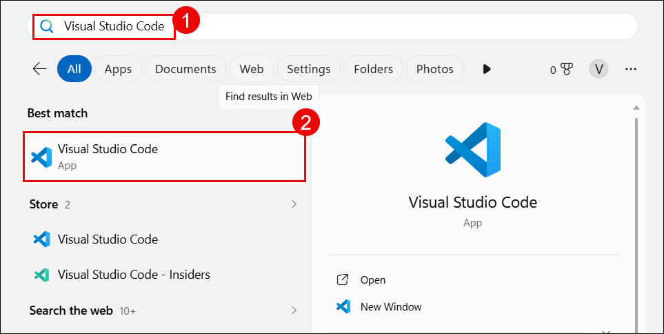

1. Click **File** -> **Open Folder**.

   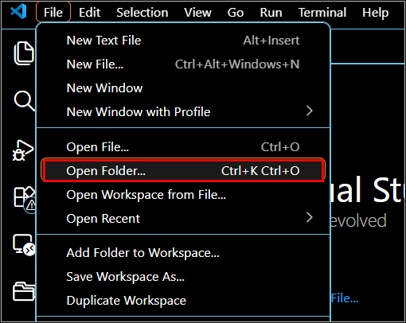

1. Open the Dream Team repository folder.

   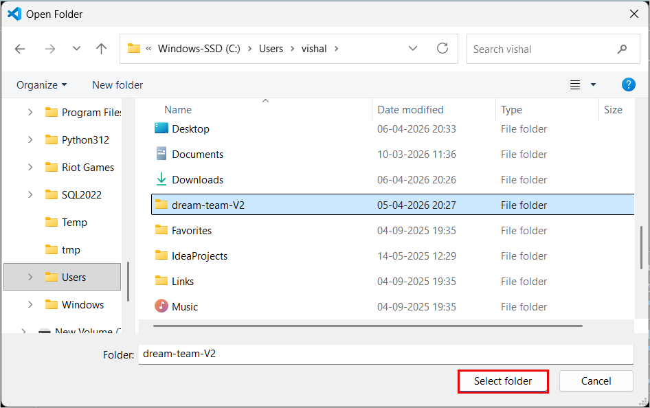

1. Review the folder tree in VS Code.

   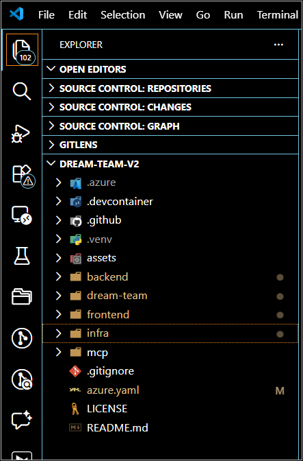

1. Open the integrated terminal.

   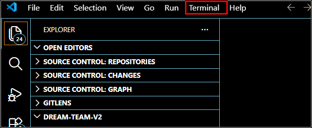

> **Congratulations** on completing the task! Now, it's time to validate it. Here are the steps:
> - If you receive a success message, you can proceed to the next task.

<validation step="lab2-task1-validate" />

---

### Task 2: Understand the Project Structure

1. Review the main folders in the repository:

   ```text
   dream-team-V2/
   ├── backend/      <- FastAPI + AutoGen / Magentic-One app
   ├── mcp/          <- MCP server
   ├── frontend/     <- React / Vite frontend
   ├── lab/          <- foundation provisioning guide
   ├── Labguidemain/ <- learner-facing hands-on labs
   ├── infra/        <- repo infrastructure assets
   └── azure.yaml
   ```

   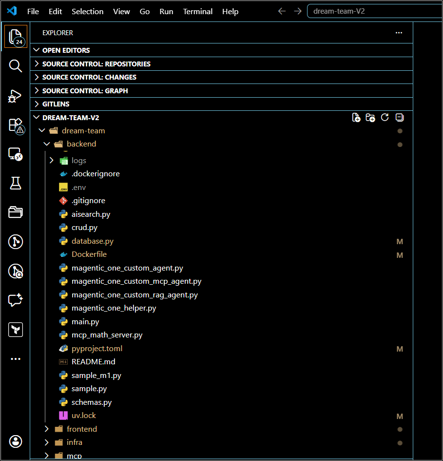

1. Open one of the backend agent-related files to see how the backend is structured.

   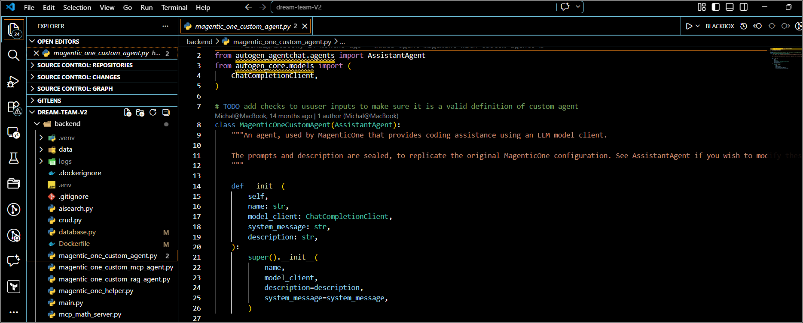

1. Open [`backend/main.py`](/z:/projectspek/Dream-team-v2/backend/main.py). This is the FastAPI entry point for the backend.

   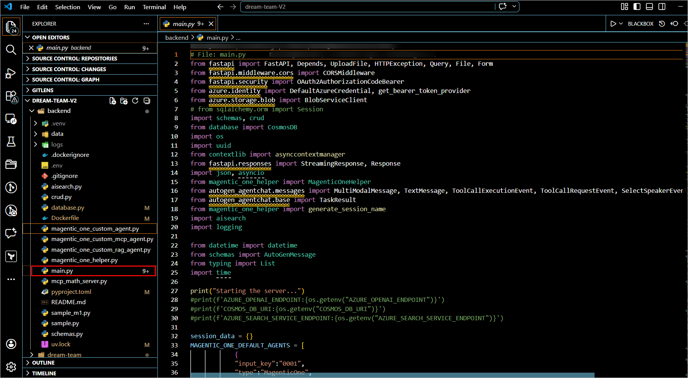

1. Review the environment template or project guidance that shows which variables the backend expects.

   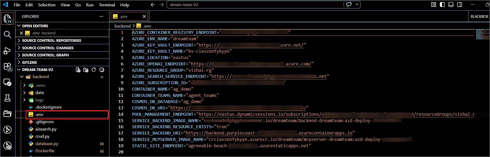

> **Congratulations** on completing the task! Now, it's time to validate it. Here are the steps:
> - If you receive a success message, you can proceed to the next task.

<validation step="lab2-task2-validate" />

---

### Task 3: Configure the Backend Environment File

1. In the terminal, go to the backend folder and create `.env` if it does not exist:

   ```powershell
   cd C:\Users\vishal\dream-team-V2\backend
   New-Item .env
   ```

   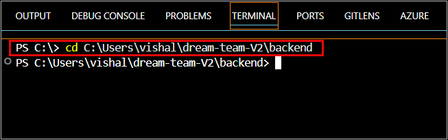

1. Open `backend/.env` and populate it with the values you collected in Lab 1.

1. Use a backend environment file that matches the current learner flow. Example:

   ```env
   AZURE_OPENAI_ENDPOINT=https://<your-openai-name>.openai.azure.com/
   AZURE_OPENAI_DEPLOYMENT=gpt-4o
   AZURE_OPENAI_DEPLOYMENT_MINI=gpt-4o-mini
   AZURE_OPENAI_DEPLOYMENT_EMBEDDING=text-embedding-3-large
   AZURE_OPENAI_EMBEDDING_MODEL=text-embedding-3-large
   COSMOS_DB_URI=https://<your-cosmos-account>.documents.azure.com:443/
   COSMOS_DB_DATABASE=ag_demo
   CONTAINER_NAME=ag_demo
   CONTAINER_TEAMS_NAME=agent_teams
   AZURE_SEARCH_SERVICE_ENDPOINT=https://<your-search-service>.search.windows.net
   AZURE_STORAGE_ACCOUNT_ENDPOINT=https://<your-storage-account>.blob.core.windows.net/
   AZURE_STORAGE_ACCOUNT_ID=/subscriptions/.../resourceGroups/.../providers/Microsoft.Storage/storageAccounts/<your-storage-account>
   APPLICATIONINSIGHTS_CONNECTION_STRING=InstrumentationKey=...
   POOL_MANAGEMENT_ENDPOINT=https://<your-session-pool-endpoint>
   AZURE_CLIENT_ID=<managed-identity-client-id>
   UAMI_RESOURCE_ID=/subscriptions/.../resourceGroups/.../providers/Microsoft.ManagedIdentity/userAssignedIdentities/<identity-name>
   MCP_SERVER_URI=https://<your-mcp-app>.azurecontainerapps.io
   MCP_SERVER_API_KEY=<shared-mcp-api-key>
   ```

1. Save the file.

   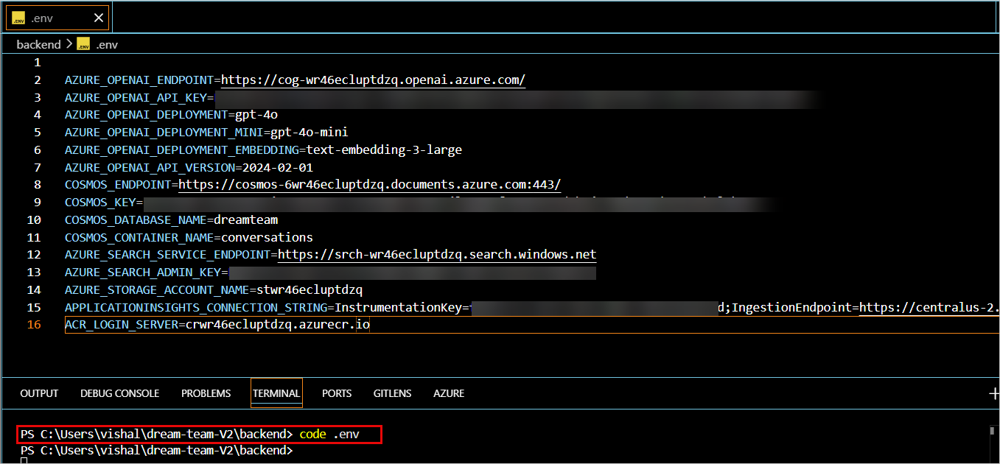

> **Note:** `Do not add spaces around the = sign, and do not wrap values in quotes unless your environment specifically requires it.`

> **Congratulations** on completing the task! Now, it's time to validate it. Here are the steps:
> - If you receive a success message, you can proceed to the next task.

<validation step="lab2-task3-validate" />

---

### Task 4: Configure the Frontend Environment File

1. In the terminal, go to the frontend folder and create `.env` if it does not exist:

   ```powershell
   cd C:\Users\vishal\dream-team-V2\frontend
   New-Item .env
   ```

   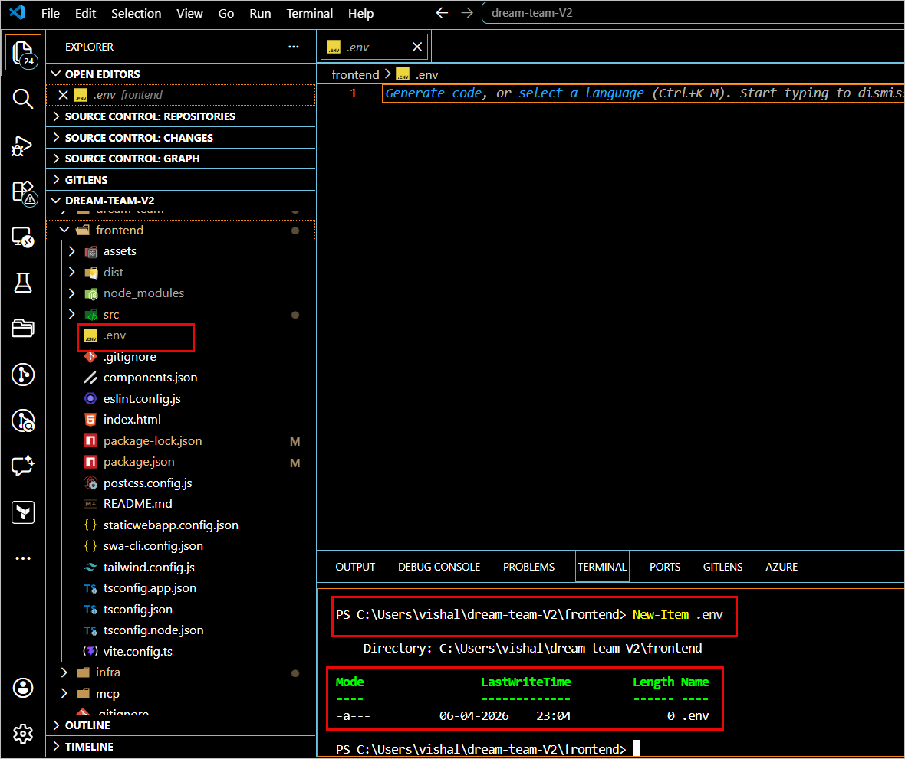

1. Open `frontend/.env` and add:

   ```env
   VITE_BASE_URL=https://<your-backend-app>.azurecontainerapps.io
   VITE_ALLWAYS_LOGGED_IN=true
   ```

   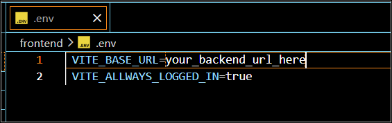

1. Replace the placeholder with your backend Container App URL from Lab 1.

   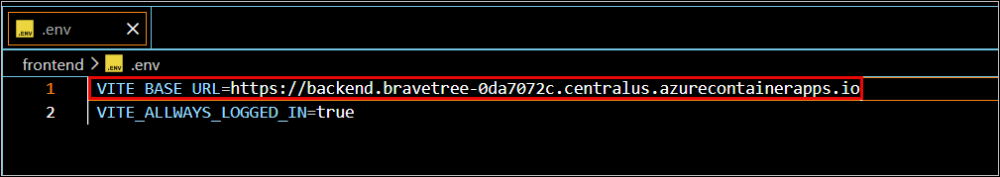

1. Save the file and compare the value with the URL shown in the Azure Portal for the backend Container App.

   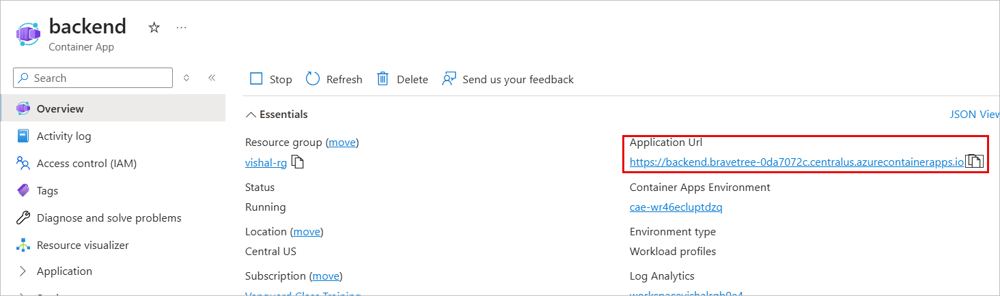

> **Congratulations** on completing the task! Now, it's time to validate it. Here are the steps:
> - If you receive a success message, you can proceed to the next task.

<validation step="lab2-task4-validate" />

---

### Task 5: Verify the Configuration Before Deployment

1. Print the backend `.env` file and verify that no placeholder values remain:

   ```powershell
   cd C:\Users\vishal\dream-team-V2\backend
   type .env
   ```

   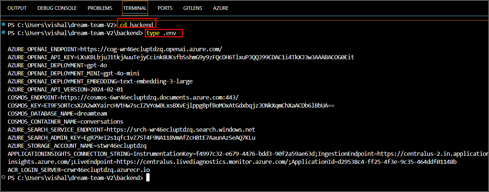

1. Print the frontend `.env` file and verify the backend URL:

   ```powershell
   cd C:\Users\vishal\dream-team-V2\frontend
   type .env
   ```

   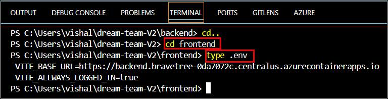

1. Optionally run a quick Python check to confirm the backend environment file loads correctly:

   ```powershell
   cd C:\Users\vishal\dream-team-V2\backend
   .\.venv\Scripts\Activate
   python -c "from dotenv import load_dotenv; import os; load_dotenv(); print('OpenAI:', os.getenv('AZURE_OPENAI_ENDPOINT')); print('Cosmos:', os.getenv('COSMOS_DB_URI')); print('Search:', os.getenv('AZURE_SEARCH_SERVICE_ENDPOINT'))"
   ```

   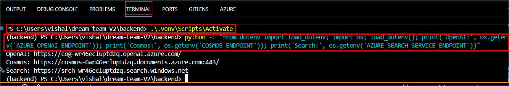

> **Congratulations** on completing the task! Now, it's time to validate it. Here are the steps:
> - If you receive a success message, you can proceed to the next task.

<validation step="lab2-task5-validate" />

---

## Review

In this exercise you connected the codebase to the Azure resources created in Lab 1 by creating backend and frontend environment files. The backend now knows how to reach Azure OpenAI, Cosmos DB, AI Search, Storage, the session pool, and the MCP service, and the frontend knows how to call the backend.

## Final Resource Split

### Pre-provisioned Resources

- Resource Group
- Log Analytics Workspace
- Application Insights
- Azure Container Registry
- Key Vault
- Cosmos DB
- Azure AI Search
- Storage Account
- Session Pool, if used

### Learner-created Resources

- Azure OpenAI resource
- Model deployments: `gpt-4o`, `gpt-4o-mini`, `text-embedding-3-large`
- Container Apps Environment
- User-assigned Managed Identity
- Backend Container App
- MCP Container App
- Static Web App
- Required role assignments
- Application configuration

**You have successfully completed Exercise 2. Click on Next >>**
