# Exercise 3: Build, Push, and Deploy the Container Images

#### Estimated Duration: 55 Minutes

## Overview

With the Azure resources created in Lab 1 and the environment files prepared in Lab 2, you are now ready to publish the application containers. In this exercise you will sign in to Azure CLI, verify the required access, build the backend and MCP Docker images, push them to Azure Container Registry, and update the Container Apps to use the new images.

## Objectives

+ **Task 1:** Verify Docker is running and sign in to Azure CLI
+ **Task 2:** Complete or verify required permissions
+ **Task 3:** Sign in to Azure Container Registry
+ **Task 4:** Build the backend Docker image
+ **Task 5:** Build the MCP Docker image
+ **Task 6:** Push both images to Azure Container Registry
+ **Task 7:** Update the backend and MCP Container Apps
+ **Task 8:** Verify both services are running

---

### Task 1: Verify Docker Is Running and Sign In to Azure CLI

1. Open Docker Desktop and confirm it is running.

   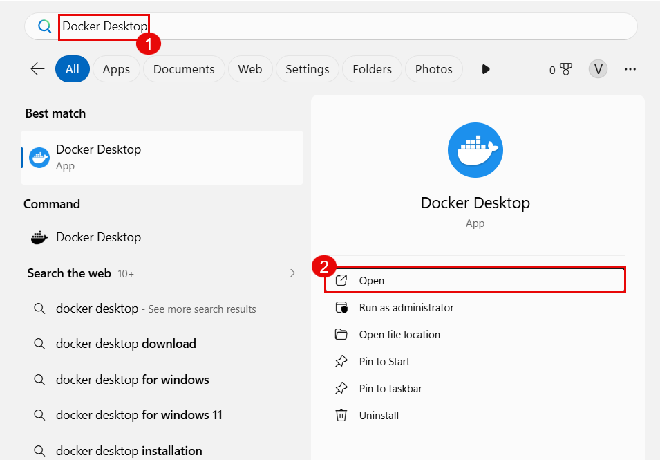

1. In VS Code, open the integrated terminal and verify Docker:

   ```powershell
   docker --version
   ```

   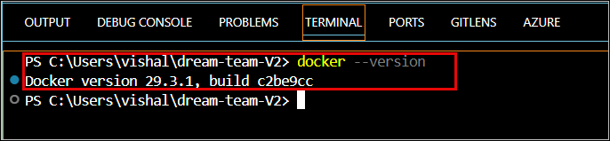

1. Sign in to Azure CLI:

   ```powershell
   az login
   ```

   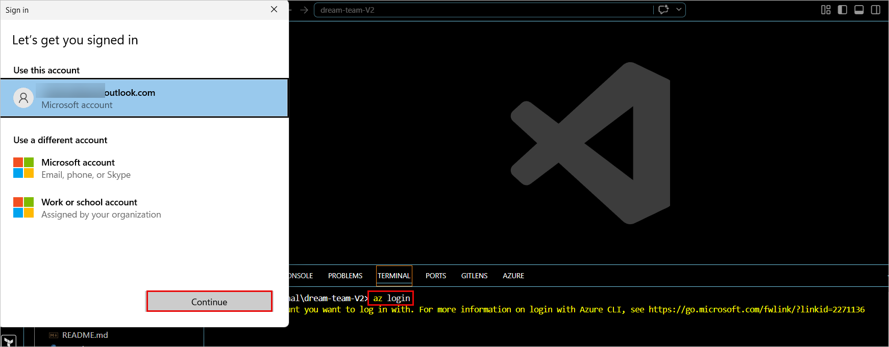

1. Set the correct subscription if needed:

   ```powershell
   az account set --subscription "<YOUR_SUBSCRIPTION_ID>"
   ```

   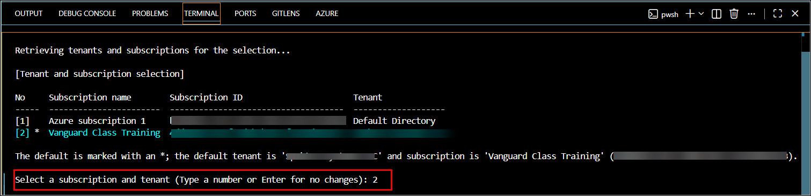

> **Congratulations** on completing the task! Now, it's time to validate it. Here are the steps:
> - If you receive a success message, you can proceed to the next task.

<validation step="lab3-task1-validate" />

---

### Task 2: Complete or Verify Required Permissions

The managed identity created in Lab 1 must be able to access the shared foundation resources used by the app.

Verify or assign the following:

- `AcrPull` on Azure Container Registry
- `Storage Blob Data Contributor` on Storage Account
- `Search Service Contributor` on Azure AI Search
- `Search Index Data Contributor` on Azure AI Search
- `Cosmos DB Built-in Data Contributor` on Cosmos DB

If your lab delivery uses CLI for the remaining assignments, use the equivalent Azure CLI commands for Cosmos DB or AI Search and verify the result.

   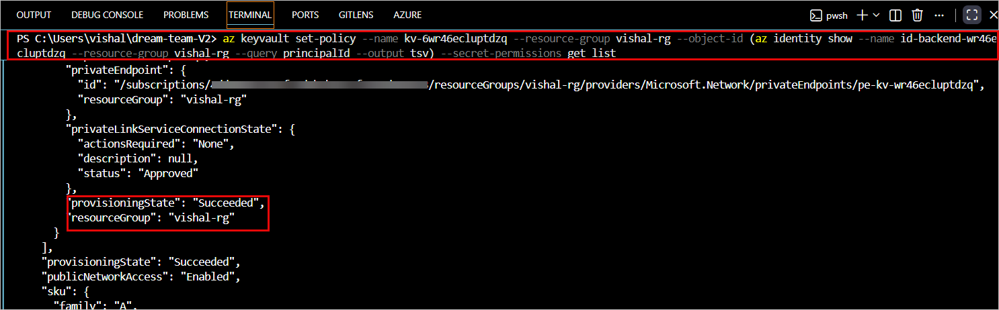

   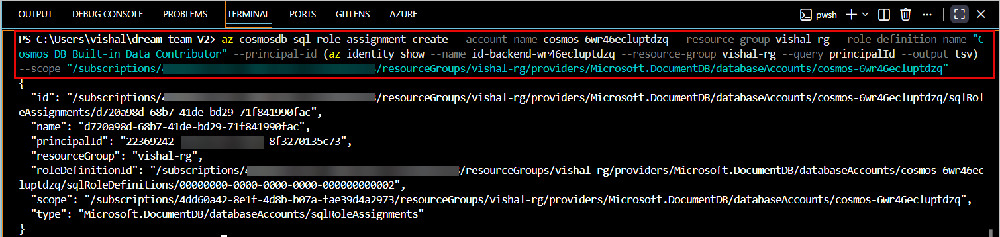

   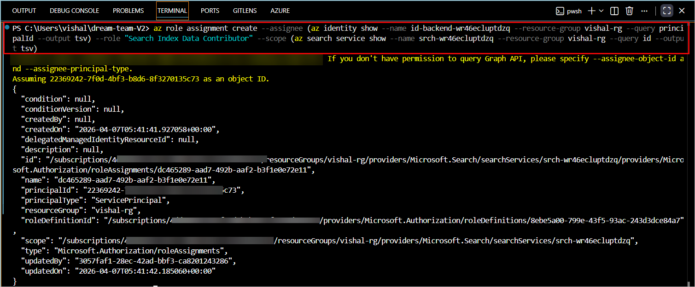

   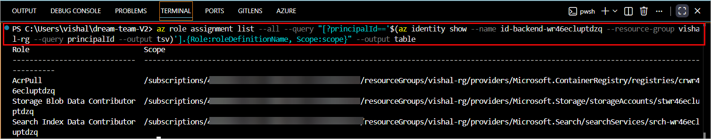

> **Congratulations** on completing the task! Now, it's time to validate it. Here are the steps:
> - If you receive a success message, you can proceed to the next task.

<validation step="lab3-task2-validate" />

---

### Task 3: Sign In to Azure Container Registry

1. Sign Docker in to your Azure Container Registry:

   ```powershell
   az acr login --name crwr46ecluptdzq
   ```

   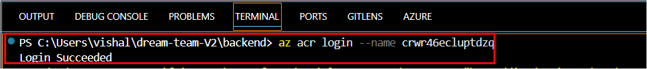

1. List the repositories in the registry:

   ```powershell
   az acr repository list --name crwr46ecluptdzq --output table
   ```

   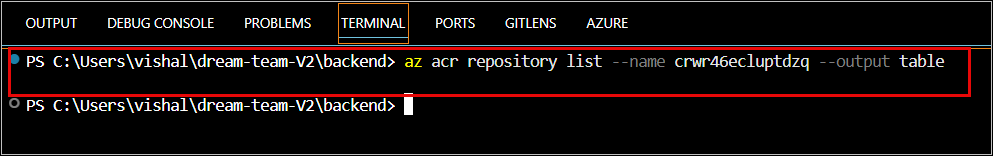

> **Congratulations** on completing the task! Now, it's time to validate it. Here are the steps:
> - If you receive a success message, you can proceed to the next task.

<validation step="lab3-task3-validate" />

---

### Task 4: Build the Backend Docker Image

1. Navigate to the backend folder:

   ```powershell
   cd C:\Users\vishal\dream-team-V2\backend
   ```

1. Review the Dockerfile:

   ```powershell
   code Dockerfile
   ```

   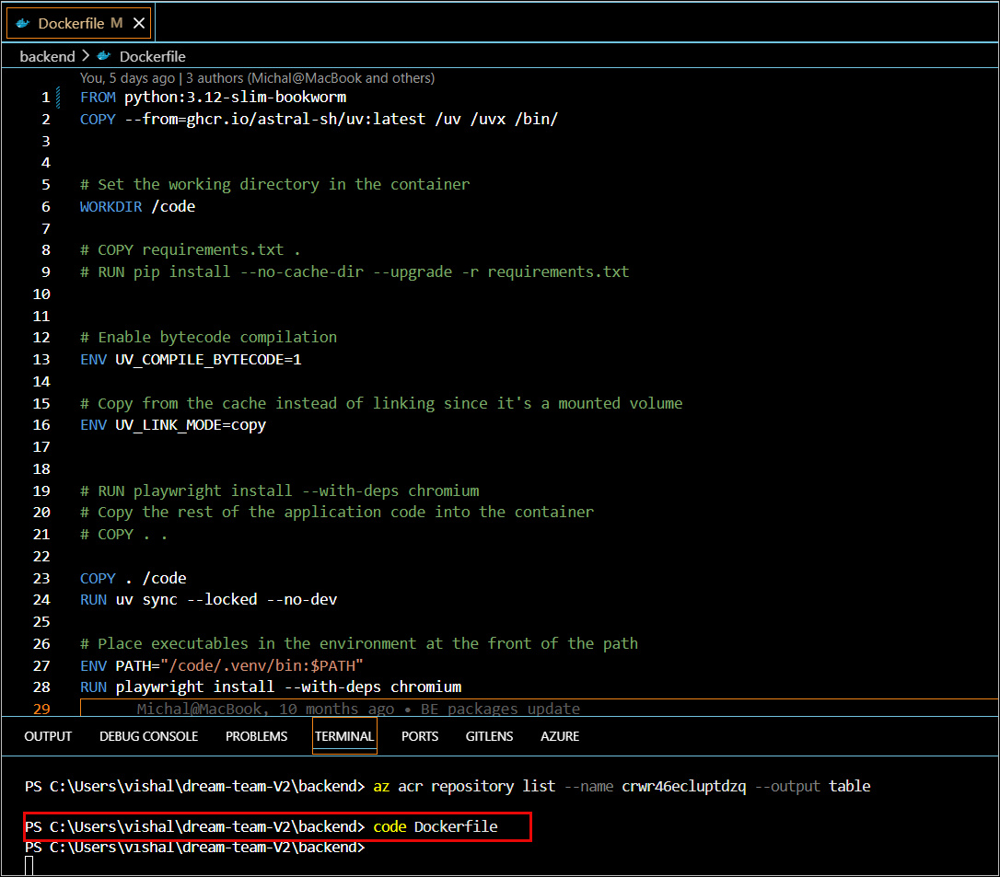

1. Build the backend image:

   ```powershell
   docker build -t backend:latest .
   ```

   

1. Verify the image exists:

   ```powershell
   docker images
   ```

   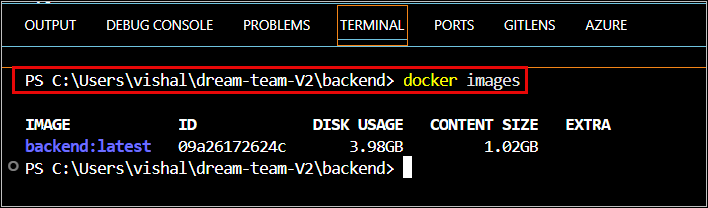

> **Congratulations** on completing the task! Now, it's time to validate it. Here are the steps:
> - If you receive a success message, you can proceed to the next task.

<validation step="lab3-task4-validate" />

---

### Task 5: Build the MCP Docker Image

1. Navigate to the MCP folder:

   ```powershell
   cd C:\Users\vishal\dream-team-V2\mcp
   ```

1. Build the MCP image:

   ```powershell
   docker build -t mcpserver:latest .
   ```

1. Verify both images exist locally:

   ```powershell
   docker images
   ```

> **Note:** `If your image naming standard is different in your environment, keep the same repository names you plan to use in Azure Container Registry.`

> **Congratulations** on completing the task! Now, it's time to validate it. Here are the steps:
> - If you receive a success message, you can proceed to the next task.

<validation step="lab3-task5-validate" />

---

### Task 6: Push Both Images to Azure Container Registry

1. Tag the backend image:

   ```powershell
   docker tag backend:latest crwr46ecluptdzq.azurecr.io/backend:latest
   ```

   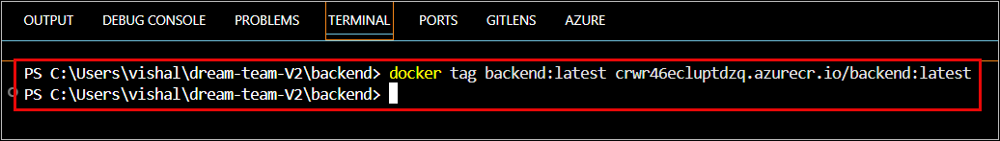

1. Verify the backend tags:

   ```powershell
   docker images
   ```

   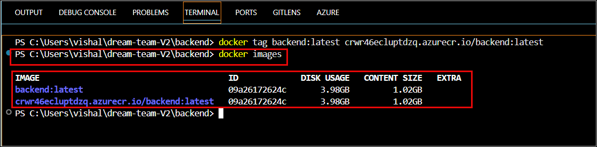

1. Push the backend image:

   ```powershell
   docker push crwr46ecluptdzq.azurecr.io/backend:latest
   ```

   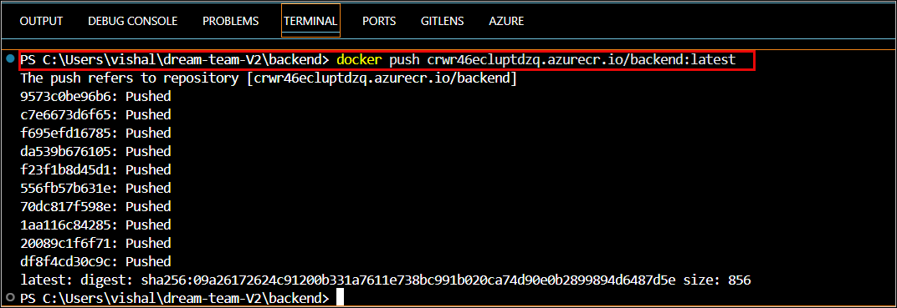

1. Tag and push the MCP image:

   ```powershell
   docker tag mcpserver:latest crwr46ecluptdzq.azurecr.io/mcpserver:latest
   docker push crwr46ecluptdzq.azurecr.io/mcpserver:latest
   ```

1. Verify the repositories exist in Azure Container Registry:

   ```powershell
   az acr repository list --name crwr46ecluptdzq --output table
   ```

   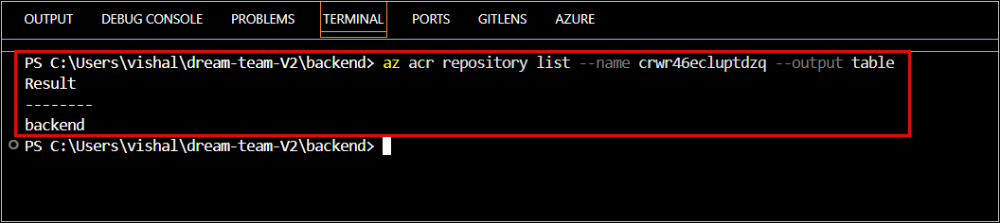

1. Optionally verify the repositories in the Azure Portal.

   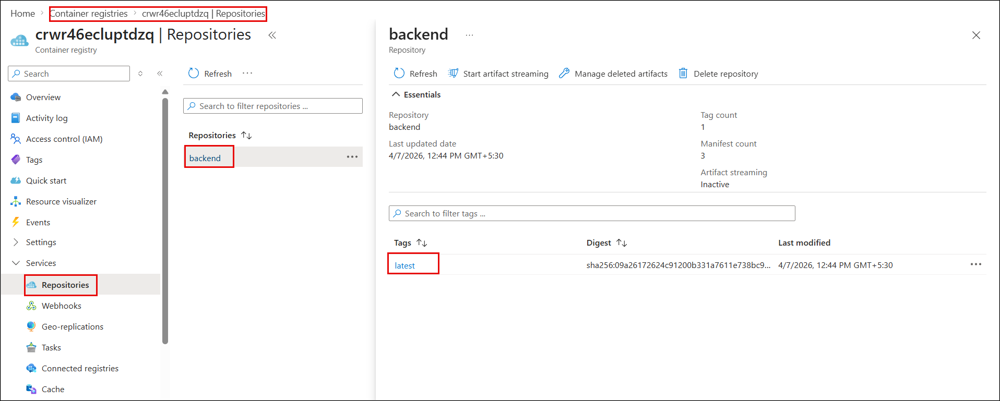

> **Congratulations** on completing the task! Now, it's time to validate it. Here are the steps:
> - If you receive a success message, you can proceed to the next task.

<validation step="lab3-task6-validate" />

---

### Task 7: Update the Backend and MCP Container Apps

1. Update the backend Container App to use the backend image:

   ```powershell
   az containerapp update --name backend --resource-group vishal-rg --image crwr46ecluptdzq.azurecr.io/backend:latest
   ```

   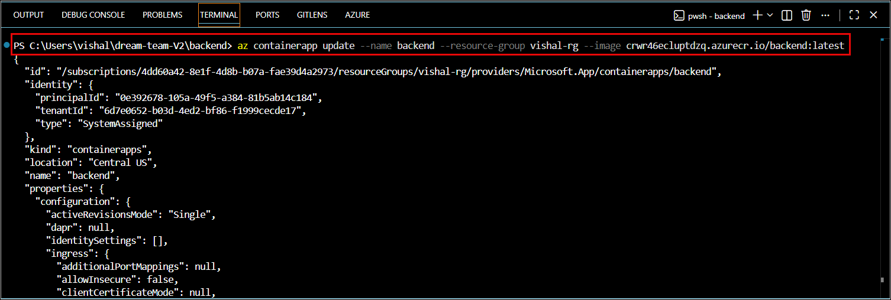

1. Open the backend Container App in the portal and confirm a new revision is created and becomes active.

   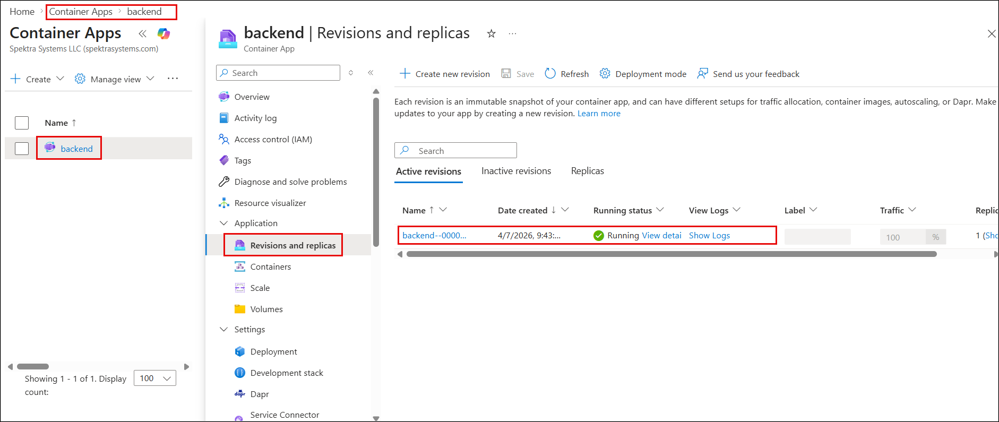

1. Update the MCP Container App:

   ```powershell
   az containerapp update --name mcpserver --resource-group vishal-rg --image crwr46ecluptdzq.azurecr.io/mcpserver:latest
   ```

1. Confirm the MCP app also rolls out a new revision successfully.

> **Congratulations** on completing the task! Now, it's time to validate it. Here are the steps:
> - If you receive a success message, you can proceed to the next task.

<validation step="lab3-task7-validate" />

---

### Task 8: Verify Both Services Are Running

1. Open the backend health endpoint:

   ```text
   https://backend.<your-suffix>.azurecontainerapps.io/health
   ```

   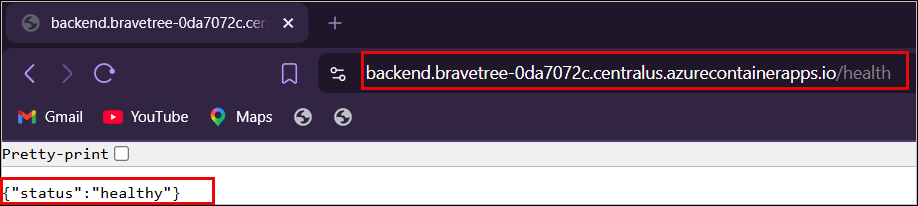

1. In the Azure Portal, open **backend** -> **Log stream** and confirm the app is starting normally.

   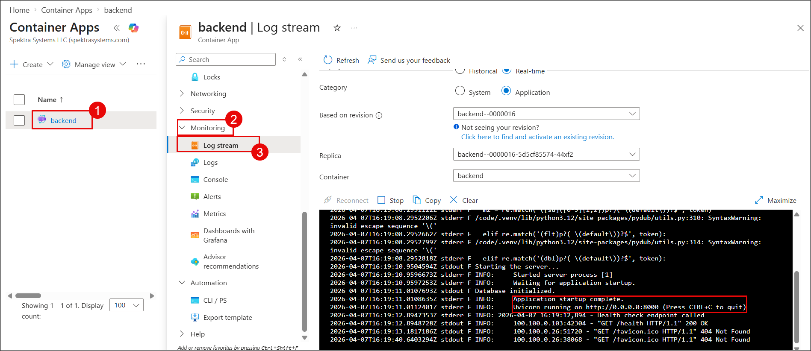

1. Open **Application Insights** and confirm telemetry is flowing from the backend.

   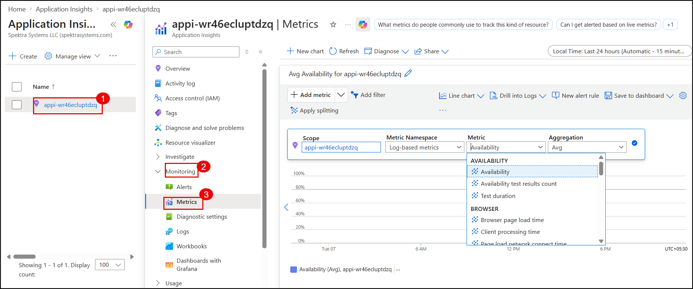

1. Open the MCP app URL and verify the service responds as expected for your environment.

> **Congratulations** on completing the task! Now, it's time to validate it. Here are the steps:
> - If you receive a success message, you can proceed to the next task.

<validation step="lab3-task8-validate" />

---

## Review

In this exercise you built the backend and MCP container images, pushed them to Azure Container Registry, and updated both Container Apps to use the live images. The service layer for the Dream Team application is now running in Azure and ready for frontend deployment.

## Final Resource Split

### Pre-provisioned Resources

- Resource Group
- Log Analytics Workspace
- Application Insights
- Azure Container Registry
- Key Vault
- Cosmos DB
- Azure AI Search
- Storage Account
- Session Pool, if used

### Learner-created Resources

- Azure OpenAI resource
- Model deployments: `gpt-4o`, `gpt-4o-mini`, `text-embedding-3-large`
- Container Apps Environment
- User-assigned Managed Identity
- Backend Container App
- MCP Container App
- Static Web App
- Required role assignments
- Docker image build / push / update steps

**You have successfully completed Exercise 3. Click on Next >>**
