# Exercise 4: Deploy the Frontend and Test the Multi-Agent System

#### Estimated Duration: 60 Minutes

## Overview

The backend and MCP services are now running. In this final exercise you will build the React frontend, deploy it to Azure Static Web Apps, verify end-to-end connectivity, and test the Dream Team multi-agent system with guided prompts.

## Objectives

+ **Task 1:** Build the React frontend
+ **Task 2:** Deploy the frontend to Azure Static Web Apps
+ **Task 3:** Verify the full application is live
+ **Task 4:** Interact with the multi-agent system
+ **Task 5:** Observe the running system in Azure monitoring

---

### Task 1: Build the React Frontend

1. In VS Code, open the terminal and go to the frontend folder:

   ```powershell
   cd C:\Users\vishal\dream-team-V2\frontend
   ```

1. Install the Node.js dependencies:

   ```powershell
   npm install
   ```

1. Build the frontend:

   ```powershell
   npm run build
   ```

   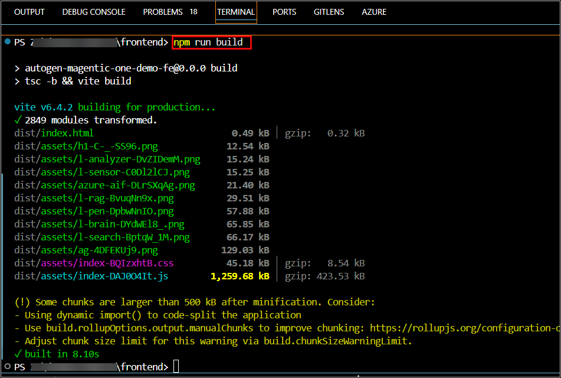

1. Verify that the `dist/` folder was created:

   ```powershell
   dir dist
   ```

   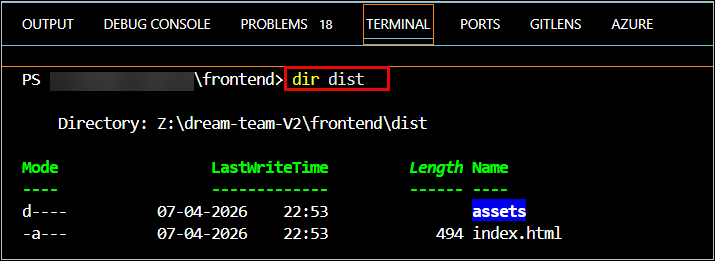

> **Congratulations** on completing the task! Now, it's time to validate it. Here are the steps:
> - If you receive a success message, you can proceed to the next task.

<validation step="lab4-task1-validate" />

---

### Task 2: Deploy the Frontend to Azure Static Web Apps

1. Install the Azure Static Web Apps CLI if needed:

   ```powershell
   npm install -g @azure/static-web-apps-cli
   ```

   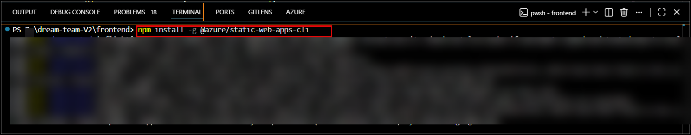

1. Deploy the built frontend using the Static Web App created in Lab 1:

   ```powershell
   swa deploy ./dist --app-name <static-web-app-name>
   ```

   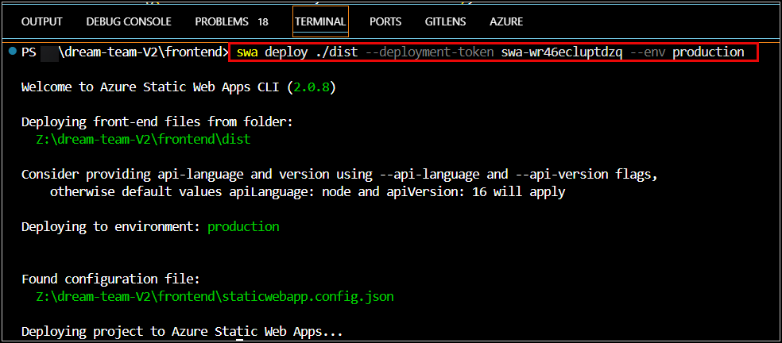

1. In the Azure Portal, open the Static Web App and verify the deployment status.

   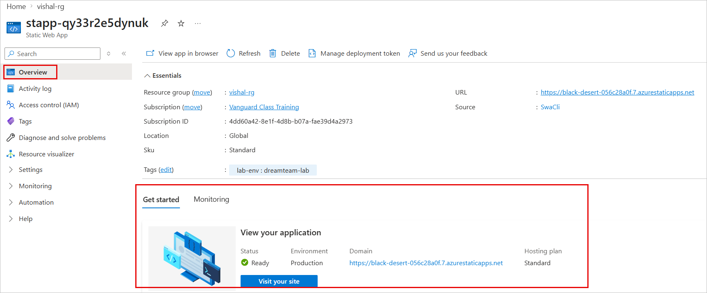

> **Congratulations** on completing the task! Now, it's time to validate it. Here are the steps:
> - If you receive a success message, you can proceed to the next task.

<validation step="lab4-task2-validate" />

---

### Task 3: Verify the Full Application Is Live

1. Open the Static Web App URL from Lab 1.

   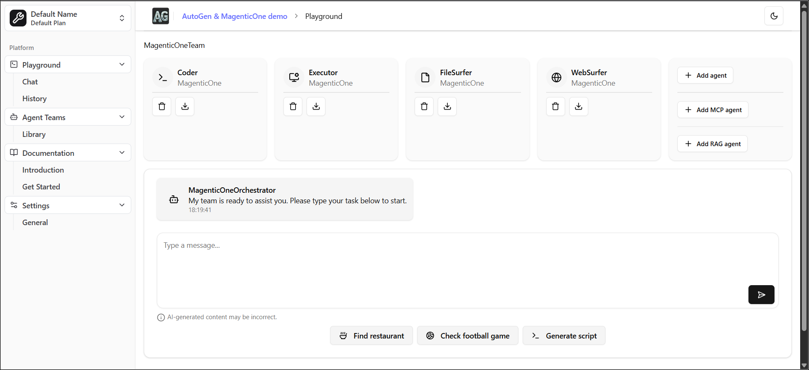

1. Send a simple test message such as:

   ```text
   Hello
   ```

   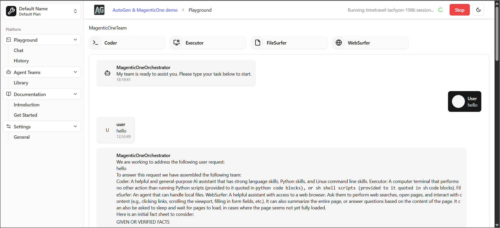

1. Open the backend Container App log stream and confirm that requests are reaching the backend.

   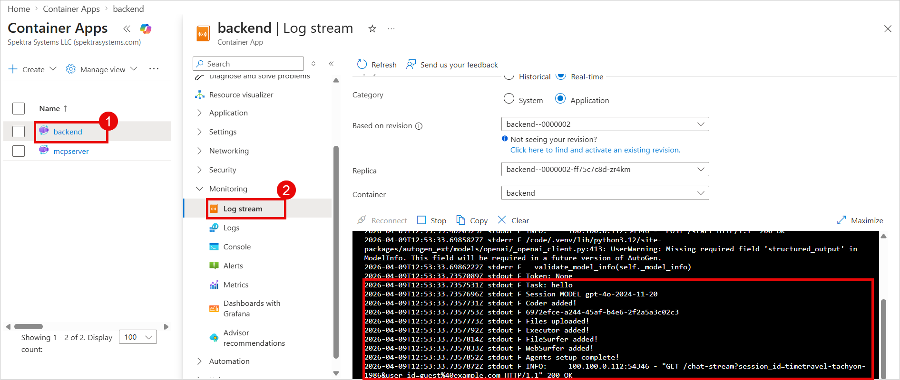

> **Congratulations** on completing the task! Now, it's time to validate it. Here are the steps:
> - If you receive a success message, you can proceed to the next task.

<validation step="lab4-task3-validate" />

---

### Task 4: Interact with the Multi-Agent System

Use the following guided prompts to exercise the different parts of the system.

#### Prompt 1: Concept question

```text
What is a multi-agent AI system and how is it different from a single AI assistant?
```

   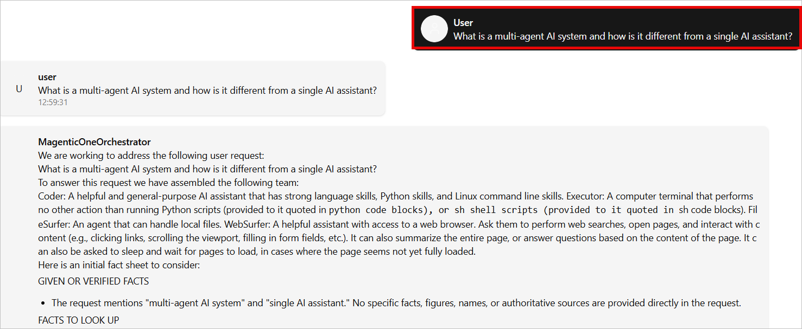

#### Prompt 2: Multi-step research

```text
Research the top 3 use cases for multi-agent AI systems in enterprise. For each, explain the problem it solves, which agent roles are needed, and the business benefit.
```

   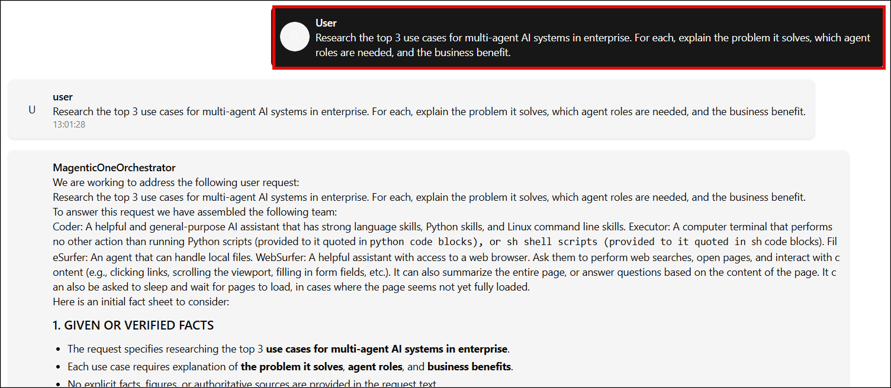

#### Prompt 3: Technical coding task

```text
Write a Python function that connects to Azure Cosmos DB using the cosmos-client SDK, queries the conversations container, and returns the 5 most recent conversation documents sorted by timestamp.
```

   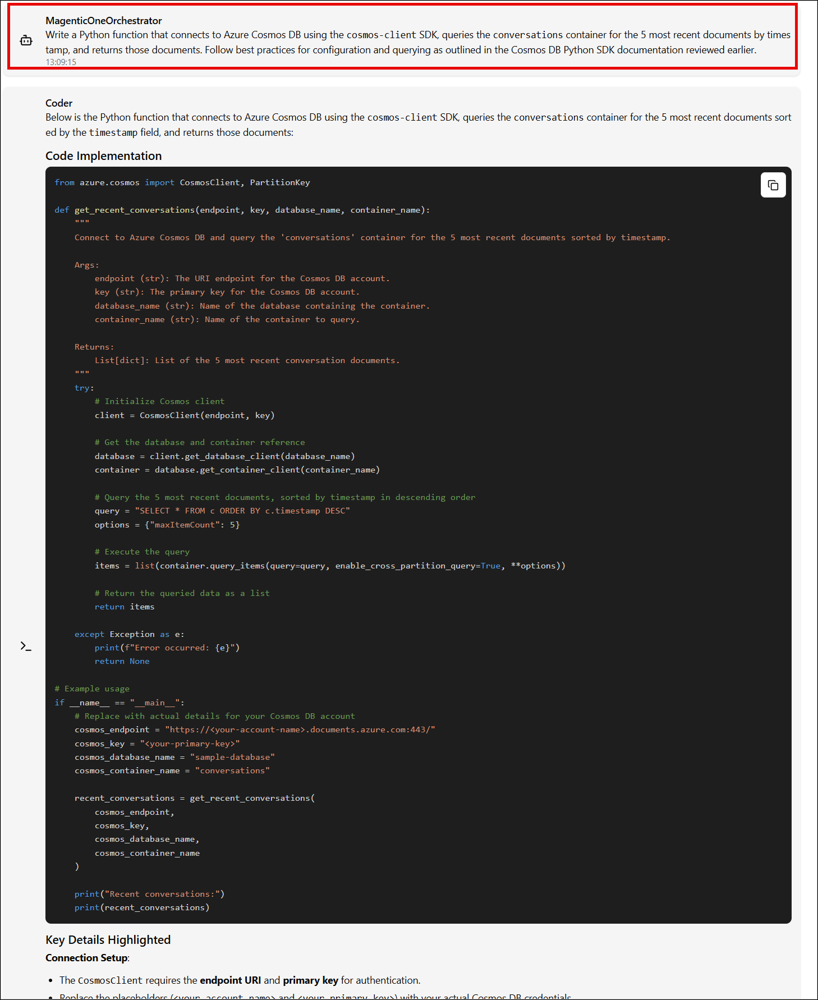

#### Prompt 4: Embedding and search

```text
Explain how text embeddings work and why the text-embedding-3-large model is used alongside gpt-4o in a multi-agent system. What role does Azure AI Search play?
```

   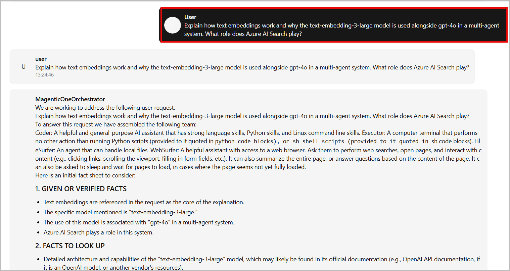

#### Prompt 5: Complex analysis

```text
Act as a startup advisor. I am building a B2B SaaS product for hospital procurement. Analyse the market opportunity, suggest a go-to-market strategy, identify the top 3 risks, and recommend an AI feature roadmap for the first 12 months. Format the output as an executive briefing document.
```

   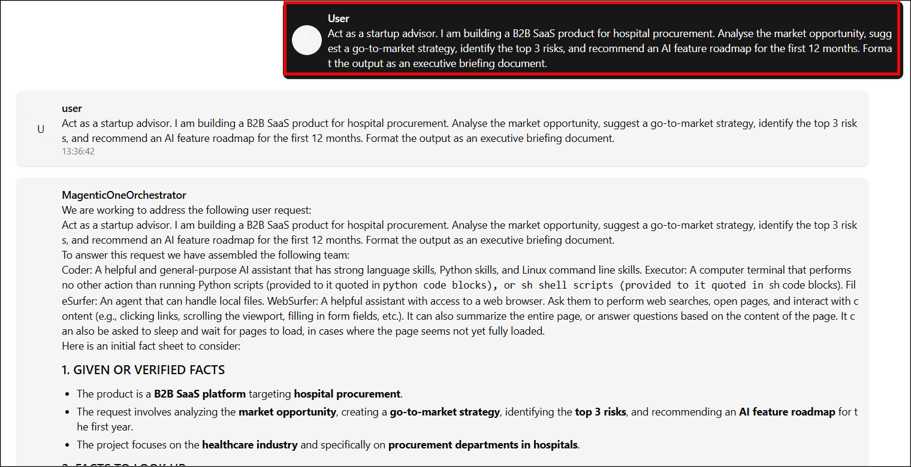

> **Congratulations** on completing the task! Now, it's time to validate it. Here are the steps:

<validation step="lab4-task4-validate" />

---


## Review

In this exercise you built and deployed the React frontend, verified that the full application path works end to end, and tested the multi-agent system through the learner-created Azure resources. 
## Final Resource Split

### Pre-provisioned Resources

- Resource Group
- Log Analytics Workspace
- Application Insights
- Azure Container Registry
- Key Vault
- Cosmos DB
- Azure AI Search
- Storage Account
- Session Pool, if used

### Learner-created Resources

- Azure OpenAI resource
- Model deployments: `gpt-4o`, `gpt-4o-mini`, `text-embedding-3-large`
- Container Apps Environment
- User-assigned Managed Identity
- Backend Container App
- MCP Container App
- Static Web App
- Required role assignments
- Frontend deployment and end-to-end testing

**You have successfully completed the lab.**
